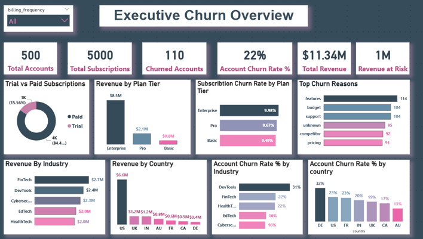
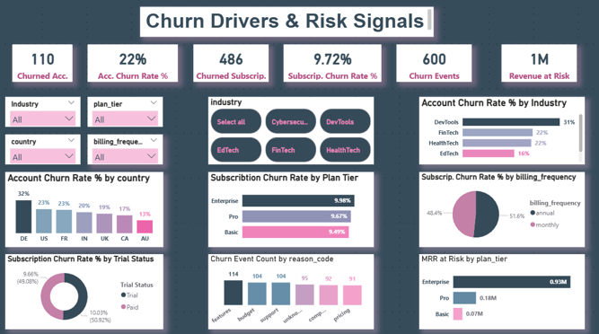
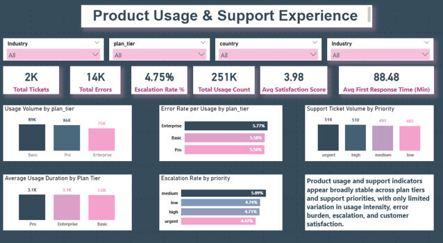

# RavenStack Churn Analysis

End-to-end SaaS churn analysis project covering SQL preparation, data quality assessment, exploratory analysis, feature engineering, modeling assessment, and Power BI dashboards.

## Project Overview

This project was developed to build a churn and retention intelligence framework for a fictional B2B SaaS company, RavenStack.

The project workflow covered:
- SQL-based relational preparation
- Data quality assessment and cleaning
- Exploratory data analysis (EDA)
- Feature engineering
- Account-level and subscription-level churn modeling
- Power BI dashboard reporting

## Repository Scope

This repository contains original analysis, reporting, dashboard design, and project documentation created by the repository owner.

The RavenStack dataset used in this project is a third-party synthetic dataset credited separately below and is not claimed here as original work.

## Key Outcome

The project showed that the current dataset supports strong descriptive and diagnostic churn analysis, while predictive performance remained weak in the current feature space.

As a result, the main value of the project lies in providing a retention intelligence framework rather than a production-ready churn prediction model.

## Repository Structure

- `Data/` → cleaned datasets and analytical tables
- `Notebooks/` → Python notebooks for cleaning, EDA, and feature engineering
- `SQL/` → SQL preparation and integration logic
- `Project_Report/` → final written report
- `Power_bi/` → Power BI file
- `Dashboards/` → dashboard screenshots

## Power BI Dashboards

### 1. Executive Churn Overview

### 2. Churn Drivers & Risk Signals

### 3. Product Usage & Support Experience

## Main Project Files

- `Notebooks/Data Quality Assessment and Cleaning.ipynb`
- `Notebooks/EDA_Feature-engineering.ipynb`
- `Project_Report/Report.pdf`
- `SQL/SQL_Report.sql`
- `Power_bi/RavenStack.pbix.zip`

## Dataset Attribution

This project uses the RavenStack synthetic SaaS dataset (multi-table), created by River @ Rivalytics.

The dataset is fully synthetic (no PII) and is used here for educational and portfolio purposes.

Credit to the original dataset author:  
River @ Rivalytics

Source available upon request.

## License

Unless otherwise stated, the original code, notebooks, SQL work, dashboard design, and written project materials in this repository are licensed under the MIT License.

This repository does not redistribute the original RavenStack dataset files.

## Reuse and Rights Notice

Unless otherwise stated, the original analysis, written report content, dashboard design, and repository structure in this project are the work of the repository owner.

Third-party dataset files included in this repository remain subject to the original dataset author's stated terms and attribution requirements.

No independent relicensing of the RavenStack dataset is claimed or granted by this repository.

